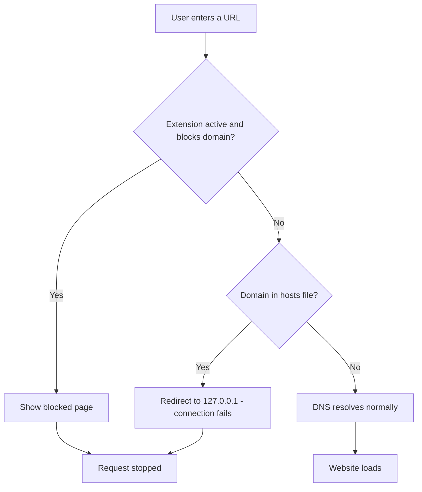

#  Smart Network-Level Web Content Filter

A **Fortinet-style** web content filtering system that blocks websites at **two levels**:

1. **Browser Level** — Chrome extension using `declarativeNetRequest` (instant, per-browser)
2. **System Level** — Node.js backend modifying the OS hosts file (blocks across ALL browsers)

---

## Project Structure

```
smart-web-filter/
├── extension/              # Chrome Extension (Manifest V3)
│   ├── manifest.json       # Extension manifest
│   ├── popup.html          # Popup UI with categories
│   ├── popup.js            # Popup logic & backend sync
│   ├── background.js       # Service worker (declarativeNetRequest)
│   ├── block.html          # Blocked page shown to users
│   ├── rules.js             # Category-to-domain mapping
│   └── icons/               # Extension icons
│
├── backend/                # Node.js Backend Server
│   ├── server.js           # Express server (port 5000)
│   ├── blocker.js           # Hosts file modifier
│   ├── reset.js              # Hosts file restorer
│   ├── rules.js              # Category rules (shared)
│   └── package.json         # Backend dependencies
│
└── README.md               # This file
```

---

## Quick Start

### 1. Install the Chrome Extension

1. Open `chrome://extensions` in Chrome/Edge/Brave
2. Enable **Developer mode** (toggle in top-right)
3. Click **Load unpacked** → select the `extension/` folder
4. Click the extension icon → select categories → **Apply & Save Rules**

### 2. Start the Backend Server (for System-Wide Blocking)

```bash
cd backend
npm install
```

**Windows** (run Command Prompt as Administrator):
```bash
node server.js
```

**Linux/macOS**:
```bash
sudo node server.js
```

3. In the extension, go to the **System** tab → Click **Check Backend Connection**
4. Click **📡 Sync Rules to Backend** to block sites system-wide

---

##  How It Works

### Layer 1: Browser Extension (declarativeNetRequest)
- Blocks sites **before** the browser makes a network request
- Redirects to a "blocked" page
- Works instantly, no backend needed
- Only affects the browser where it's installed

### Layer 2: System Hosts File (Node.js Backend)
- Modifies `C:\Windows\System32\drivers\etc\hosts` (Windows) or `/etc/hosts` (Linux/macOS)
- Redirects domains to `127.0.0.1` (localhost)
- **Blocks sites across ALL browsers and applications**
- Requires Administrator/root privileges

### How This Simulates Firewall-Level Filtering

| Concept | Implementation |
|---------|---------------|
| **Packet Filtering** | Hosts file redirects DNS to 127.0.0.1 |
| **URL Filtering** | declarativeNetRequest matches URL patterns |
| **Category-Based Rules** | Predefined domain lists per category |
| **Application Layer** | Extension operates at HTTP/HTTPS level |
| **Network Layer** | Hosts file operates at DNS resolution level |

---

## Request Flow (Flowchart)

The diagram below shows what happens when a user tries to visit a website, from the moment a URL is entered to the point it's either blocked or allowed through, across both filtering layers.



**Reading the flow:**
1. A request first hits the **Chrome extension** (Layer 1) if it's installed and active.
2. If the extension blocks the category, the user immediately sees the custom blocked page — no network request is ever sent.
3. If the extension allows it (or isn't installed), the request proceeds to **DNS resolution**, where the **hosts file** (Layer 2) is checked.
4. If the domain has been redirected to `127.0.0.1`, the connection is black-holed and fails silently.
5. If neither layer blocks it, the site loads normally.

This mirrors **defense in depth**: even if one layer is bypassed (e.g., extension disabled, or a browser other than the one it's installed in), the other layer can still catch the request.

---

## API Endpoints

| Method | Endpoint | Description |
|--------|----------|-------------|
| `GET` | `/status` | Health check |
| `POST` | `/block` | Block domains (body: `{ categories, customDomains }`) |
| `POST` | `/reset` | Remove all blocks from hosts file |
| `GET` | `/rules` | List all available categories and domains |

---

## Features

- ✅ 8 pre-built categories (Games, Adult, Social, Stocks, Streaming, News, Shopping, Gambling)
- ✅ Custom domain blocking
- ✅ Focus mode with timer
- ✅ Block logging
- ✅ System-wide blocking via hosts file
- ✅ Duplicate prevention in hosts file
- ✅ One-click unblock/reset
- ✅ Clean, beginner-friendly code

---

## Important Notes

- **Administrator privileges required** for hosts file modification
- Hosts file changes may require a **DNS cache flush**:
  - Windows: `ipconfig /flushdns`
  - macOS: `sudo dscacheutil -flushcache`
  - Linux: `sudo systemd-resolve --flush-caches`
- The extension works immediately without the backend
- The backend adds system-wide blocking across all browsers

---
